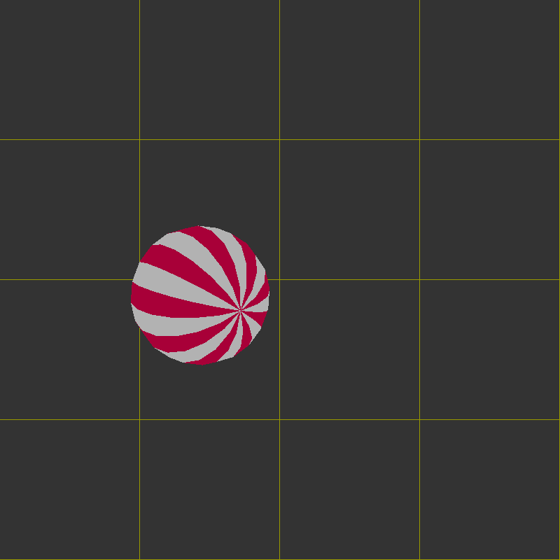

# bounce-cpp

This is just a bouncing ball that's drawn using OpenGL. To compile and run, first ensure that you have the appropriate build tools, the OpenGL libraries, and the SDL2 library installed. On Debian Systems:

<pre>
apt-get install build-essential libglu1-mesa-dev libgles2-mesa-dev libsdl2-dev
</pre>

<pre>
To build:

mkdir build
cd build
cmake ..
make
</pre>

This project was heavily inspired by the classic bounce.c\
<https://www.opengl.org/archives/resources/code/samples/glut_examples/mesademos/bounce.c>
